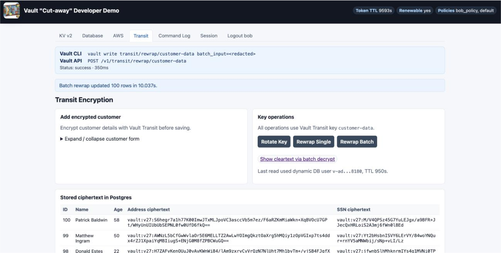

# Vault Cut-away Demo



This Flask app demonstrates several common Vault developer workflows in one UI:

- Transit encryption for customer data
- KV v2 secret CRUD and version operations
- Dynamic Postgres/RDS credentials
- Dynamic AWS credentials and leases
- A sanitized command log showing the Vault CLI and HTTP API calls used by the app

The app logs into Vault with the `userpass` auth method for `alice` or `bob`, then stores the returned client token server-side. Tokens and generated secrets are not rendered into the UI.

For the beginning-to-end presenter workflow, see [demo_workflow_howto.md](demo_workflow_howto.md).

## Requirements

```bash
pip install -r requirements.txt
```

The Postgres/RDS instance and Vault secrets engines are expected to be provisioned before running the app.

## Terraform setup

Start with [variables.tf](variables.tf), which documents the settings to customize,
and copy the annotated example:

```bash
cp terraform.tfvars.example terraform.tfvars
```

Edit `terraform.tfvars` for your AWS region, Vault endpoint, database names,
and allowed client networks. Supply `TF_VAR_login_password`,
`TF_VAR_db_password`, `TF_VAR_alice_password`, and `TF_VAR_bob_password`
through your environment or secret store. AWS credentials use the standard
provider credential chain. Keep Terraform state private: it contains passwords.

**RDS is private by default, with TLS required and no default ingress allowlist.**
Set `db_allowed_cidrs` to the narrow source ranges for Vault and your app/setup
clients, preferably individual `/32` addresses. `/0` is rejected. The example
addresses are placeholders. A security group rule alone does not provide
connectivity: arrange private routing, VPN, or peering to this VPC before Vault
verifies the database connection. This stack does not create that connectivity.
If your isolated demo needs a public endpoint, explicitly set
`db_publicly_accessible = true` and allow only the actual public egress addresses
of Vault and your clients.

Vault and its configured userpass auth mount must already exist, and the
Terraform login must have provisioning permissions. This stack creates the
database and Transit engines, two KV mounts, policies, and Alice/Bob users.
The AWS secrets engine/role and Secrets Sync destinations are configured
separately. Existing mounts must be imported into state or replaced with unused
mount names where configurable; do not apply this over unrelated Vault mounts.

```bash
terraform init
terraform plan
terraform apply
```

After applying, export the shared settings rather than retyping database names
and Vault paths. This produces shell-quoted values in the gitignored `.env` file
(overwrites that file if it already exists):

```bash
terraform output -json demo_app_environment | python3 -c 'import json, shlex, sys; print("\n".join("export " + k + "=" + shlex.quote(str(v)) for k, v in json.load(sys.stdin).items()))' > .env
source .env
export PGUSER="$(terraform output -raw db_admin_username)"
./prepare_pg.sh
```

The preparation script prompts for the RDS admin password. Run it before
requesting dynamic credentials or seeding data, then follow Seed Data below
and start the app in the same shell. The Python app does not load `.env`
automatically. Re-export settings after changing Terraform values. The manual
configuration examples below are for an existing deployment; do not overwrite
your exported settings with their example defaults.

| Terraform setting | Used by |
| --- | --- |
| `db_name` | RDS database, Vault connection/grants, KV metadata, `PGDATABASE` |
| `db_schema`, `db_table` | Vault metadata and schema grants, `PGSCHEMA`/`PGTABLE` for setup, seeding, and the app |
| `db_mount_path`, `transit_key_name` | Vault resources/policies and matching `VAULT_*` app settings |
| `userpass_mount` | Terraform login, demo users, and `VAULT_USERPASS_MOUNT` |
| `aws_mount_path`, `aws_role_name` | Policy access to existing AWS credentials and matching app settings |

Terraform is organized into `main.tf` (resources), `variables.tf` (inputs),
`policies.tf` (demo permissions), `outputs.tf` (shared environment), and
`versions.tf` (provider requirements). `moved.tf` preserves the old resource
addresses. Review existing-stack plans carefully: generic names, subnet ranges,
database username, and encrypted storage defaults can cause replacements.
Legacy organization-specific tag inputs are replaced by the `tags` map.
The fixed demo users are `alice`/`bob`; database roles are `readOnly`/`readWrite`.
Transit uses `transit/`, and KV targets retain the paths shown below.
Demo destruction skips the final database snapshot; back up any data you need.

## Vault Paths

Defaults are configurable with environment variables:

```bash
export VAULT_ADDR="https://your-vault.example:8200"
export VAULT_NAMESPACE="admin"
export VAULT_TRANSIT_KEY="customer-data"
export VAULT_DB_MOUNT="db"
export VAULT_DB_READONLY_ROLE="readOnly"
export VAULT_DB_READWRITE_ROLE="readWrite"
export VAULT_AWS_MOUNT="aws"
export VAULT_AWS_ROLE="ec2-iam-user-role"
export VAULT_USERPASS_MOUNT="userpass"
```

The KV tab updates these Secrets Sync KV v2 secrets:

- `secret/circleci-demo/demo-secrets`
- `kv-v2/database/dev`

## Demo Users

Create Vault userpass users named `alice` and `bob`, then attach the policies shown below to those users. The app login form sends the entered username/password to `auth/userpass/login/<username>` and stores the returned client token server-side.

If your userpass auth method is mounted somewhere else, set `VAULT_USERPASS_MOUNT`.

The app tracks the returned token TTL and automatically renews the token when remaining TTL reaches 50 percent of the original TTL. The page header shows remaining TTL, renewable status, and token policies.

## Postgres/RDS Configuration

Prepare an existing database with the PostgreSQL `psql` client installed:

```bash
export PGHOST="<rds-endpoint>"
export PGUSER="demo_admin" # Database owner/admin; use your actual login.
export PGDATABASE="postgres"
export PGSSLMODE="require"
./prepare_pg.sh
```

The script prompts for the database password unless supplied through `.pgpass`
or `PGPASSWORD`. It creates the schema and table, adds `created_at` to older demo
tables, and preserves existing rows. Run it with the database login configured
in Vault. If Vault uses a different existing login, set `VAULT_DB_USER` to that
login so it receives grant options on the demo objects. That login must already
have permission to create database roles. Run `./prepare_pg.sh --help` for options.

This prepares the database objects only; the database/server and Vault database
connection, roles, and Transit key must already exist. The Vault role statements
below must grant table and sequence access. Request fresh dynamic credentials
after setup (log out and back into the app if credentials are cached), then use
the Seed Data instructions below to add encrypted customers.

```bash
export PGHOST="<rds-endpoint>"
export PGPORT="5432"
export PGDATABASE="postgres"
export PGSSLMODE="require"
export PGSCHEMA="public"
export PGTABLE="customers"
```

The app expects this table shape:

```sql
CREATE TABLE IF NOT EXISTS public.customers (
  id BIGSERIAL PRIMARY KEY,
  name TEXT NOT NULL,
  age INTEGER,
  address_cipher TEXT NOT NULL,
  ssn_cipher TEXT NOT NULL,
  created_at TIMESTAMPTZ NOT NULL DEFAULT now()
);
```

The Vault database `readWrite` role must grant privileges on both the table and the sequence behind `BIGSERIAL`. In the role creation statement, include grants like:

```sql
GRANT USAGE ON SCHEMA public TO "{{name}}";
GRANT SELECT, INSERT, UPDATE ON TABLE public.customers TO "{{name}}";
GRANT USAGE, SELECT ON SEQUENCE public.customers_id_seq TO "{{name}}";
```

Or, for a broader demo schema grant:

```sql
GRANT USAGE ON SCHEMA public TO "{{name}}";
GRANT SELECT, INSERT, UPDATE ON ALL TABLES IN SCHEMA public TO "{{name}}";
GRANT USAGE, SELECT ON ALL SEQUENCES IN SCHEMA public TO "{{name}}";
```

## Run

```bash
python3 vault_demo_transit_app_batch.py
```

Open http://localhost:5001.

## Seed Data

Run `./prepare_pg.sh` first, then confirm the deployed Vault database
`readWrite` role includes the sequence grant shown above. The preparation
script grants Vault's database connection login permission to grant access;
the role's `creation_statements` must pass that access to each generated user.

Use a Vault token that can read the read-write database role and encrypt with Transit:

```bash
export VAULT_TOKEN="<bob-or-admin-token-with-demo-permissions>"
python3 seed_customers.py --count 100
```

If the dynamic database role has DDL permission and you want the script to create the table:

```bash
python3 seed_customers.py --count 100 --create-schema
```

### Troubleshooting seeding and viewing rows

- **Vault `permission denied` on `transit/encrypt/customer-data`:** the seed
  script uses the exported `VAULT_TOKEN`, while the app obtains its own token
  through userpass login. Check the seed token in the same namespace as the
  demo engines:

  ```bash
  export VAULT_NAMESPACE="admin" # Change if your demo uses another namespace.
  vault token capabilities transit/encrypt/customer-data # Needs update
  vault token capabilities db/creds/readWrite             # Needs read
  vault token capabilities db/creds/readOnly              # Needs read for app browsing
  ```

  These paths assume the default mount, key, and role names. Adjust them if
  you override the corresponding environment variables. Ensure Bob's attached
  policy includes the Read-write persona rules below. The existing demo uses
  `bob-policy`; this repository's Terraform creates `${name_prefix}-bob`
  (`vault-demo-bob` by default).
  Update the policy actually attached to your deployed user, preserving its
  other rules.

- **`Postgres denied access to the table id sequence`:** using a Vault admin
  token, append the following to the existing `creation_statements` on
  `db/roles/readWrite`, preserving its other statements and settings:

  ```sql
  GRANT USAGE, SELECT ON SEQUENCE public.customers_id_seq TO "{{name}}";
  ```

  Adjust the sequence name for a custom table. This is a Vault **database role**
  change, not a change to `bob-policy`. Retry the seed script using Bob's token;
  each run requests fresh database credentials and receives the updated grants.

- **Confirm success:** start with `python3 seed_customers.py --count 1`, then
  run with `--count 100`. Each run adds rows; it does not replace existing data.
  For the default table, verify with
  `psql -c 'SELECT count(*) FROM public.customers;'` using your database admin
  connection. Start the app from a terminal with the same `PGHOST`,
  `PGDATABASE`, `PGSCHEMA`, and `PGTABLE` settings. The Transit page reads with
  the `readOnly` database role even when logged in as Bob. Log out and back in
  to obtain fresh credentials if the app cached credentials issued before the
  grants changed.

The Python 3.9 LibreSSL/urllib3 warning is separate from Vault authorization
and PostgreSQL permission errors; changing database grants does not address
that warning.

## Expected Vault Capabilities

Read-only persona:

```hcl
path "db/creds/readOnly" {
  capabilities = ["read"]
}

path "transit/decrypt/customer-data" {
  capabilities = ["update"]
}

path "secret/data/circleci-demo/demo-secrets" {
  capabilities = ["create", "read", "update", "delete"]
}

path "secret/metadata/circleci-demo/demo-secrets" {
  capabilities = ["read", "delete"]
}

path "secret/undelete/circleci-demo/demo-secrets" {
  capabilities = ["update"]
}

path "secret/destroy/circleci-demo/demo-secrets" {
  capabilities = ["update"]
}

path "kv-v2/data/database/dev" {
  capabilities = ["create", "read", "update", "delete"]
}

path "kv-v2/metadata/database/dev" {
  capabilities = ["read", "delete"]
}

path "kv-v2/undelete/database/dev" {
  capabilities = ["update"]
}

path "kv-v2/destroy/database/dev" {
  capabilities = ["update"]
}

path "aws/creds/ec2-iam-user-role" {
  capabilities = ["read"]
}

path "sys/leases/renew" {
  capabilities = ["update"]
}

path "sys/leases/revoke" {
  capabilities = ["update"]
}
```

Read-write persona:

```hcl
path "db/creds/readOnly" {
  capabilities = ["read"]
}

path "db/creds/readWrite" {
  capabilities = ["read"]
}

path "transit/encrypt/customer-data" {
  capabilities = ["update"]
}

path "transit/decrypt/customer-data" {
  capabilities = ["update"]
}

path "transit/rewrap/customer-data" {
  capabilities = ["update"]
}

path "transit/keys/customer-data/rotate" {
  capabilities = ["update"]
}

path "secret/data/circleci-demo/demo-secrets" {
  capabilities = ["create", "read", "update", "delete"]
}

path "secret/metadata/circleci-demo/demo-secrets" {
  capabilities = ["read", "delete"]
}

path "secret/undelete/circleci-demo/demo-secrets" {
  capabilities = ["update"]
}

path "secret/destroy/circleci-demo/demo-secrets" {
  capabilities = ["update"]
}

path "kv-v2/data/database/dev" {
  capabilities = ["create", "read", "update", "delete"]
}

path "kv-v2/metadata/database/dev" {
  capabilities = ["read", "delete"]
}

path "kv-v2/undelete/database/dev" {
  capabilities = ["update"]
}

path "kv-v2/destroy/database/dev" {
  capabilities = ["update"]
}

path "aws/creds/ec2-iam-user-role" {
  capabilities = ["read"]
}

path "sys/leases/renew" {
  capabilities = ["update"]
}

path "sys/leases/revoke" {
  capabilities = ["update"]
}
```

Adjust paths if your mounts, roles, or namespace differ.

## Verification

For local configuration checks, run `terraform fmt -check -recursive` and
`terraform validate` after initialization. With Terraform 1.7 or newer, run
`terraform test` for mocked plan tests of network defaults, TLS enforcement,
and propagation of customized database/Vault settings. These tests create no
infrastructure and do not verify live network connectivity or authentication.

- Transit tab: insert a customer and confirm `address_cipher` and `ssn_cipher` start with `vault:`.
- Database tab: use the read-only role to query and the read-write role to insert a sample record.
- KV v2 tab: write a key, view version metadata, soft delete, undelete, and destroy a selected version.
- AWS tab: request credentials and confirm only masked access key and lease metadata are shown.
- Command Log tab: confirm commands show CLI/API equivalents without full tokens, passwords, KV values, AWS secret keys, or session tokens.

## Security Notes

The development server listens only on `127.0.0.1`, with debug mode disabled.

Terraform creates a private RDS instance and requires TLS for database
connections. Set `db_allowed_cidrs` explicitly to the narrow IPv4 ranges used
by your app, database preparation client, and Vault. Those clients need private network
connectivity to the database (for example, through a VPN or a runner inside
the VPC). For an isolated demo requiring a public endpoint, explicitly set
`db_publicly_accessible = true` and allow only the clients' public egress
CIDRs. Unrestricted `/0` ingress is rejected.

Review the Terraform plan before applying these settings to an existing
database: changing subnet placement or public accessibility can interrupt
connectivity. Editing this repository does not update deployed infrastructure.
After provisioning, run `./prepare_pg.sh` as described above before requesting
dynamic database credentials or seeding data. Terraform configures the database
and Vault roles; the preparation script creates the application table.

Keep credentials in environment variables or local credential stores. The
project `.gitignore` excludes local databases, environment files, Terraform
state/variable files, keys, and caches. Without `FLASK_SECRET_KEY`, the app
generates a random session-signing key at startup; restarting requires logging
in again.

This is a demo application, not production scaffolding. Use proper authentication, CSRF protection, server-side sessions, TLS, least-privilege Vault policies, and a production WSGI server for real applications.

## License

The demo code and documentation are available under the [MIT License](LICENSE).
