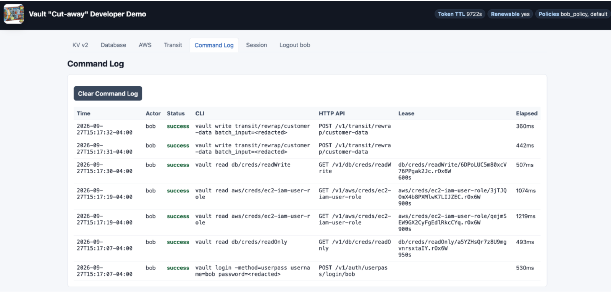

# Vault Cut-away Demo

Like a salesman's cut-away sample, this demo exposes the inner workings.
Each Vault operation shows the API call behind it, alongside its equivalent
CLI command, so you can connect what happens in the UI to what Vault does.

## Who it's for

Developers learning to integrate Vault, platform and security teams explaining
how it works, and presenters who want to walk through real Vault workflows.
The app puts the operation, its result, and the underlying calls together so
an audience can follow along.

## What the demo shows

- **Transit encryption:** encrypt customer addresses and SSNs before storing
  them in Postgres, decrypt them on demand, rotate the key, and rewrap existing
  ciphertext individually or in a batch.
- **Dynamic database credentials:** request temporary Postgres logins and
  compare read-only and read-write access.
- **KV v2 secrets:** update values and explore version history, soft deletion,
  recovery, and permanent destruction.
- **Dynamic AWS credentials:** request credentials and inspect, renew, or
  revoke their leases.
- **Authentication and token lifecycle:** sign in as Alice or Bob and see
  token policies, remaining lifetime, and automatic renewal.
- **The calls behind the clicks:** follow the sanitized command log to see
  Vault API requests and equivalent CLI commands without exposing full tokens
  or generated credentials.

## Inside the demo

The Transit view after a batch rewrap: the call appears above the controls,
while the table shows the ciphertext stored in Postgres. The same cut-away
approach carries through the database, KV, and AWS workflows.

Behind the clicks: Vault CLI commands and HTTP API calls, with status, lease
details, and execution time.

## Run it or present it

- [Setup and running instructions](setup.md) — dependencies, Terraform,
  existing infrastructure, configuration, seed data, and troubleshooting.
- [Presenter walkthrough](demo_workflow_howto.md) — demo sequence, expected
  results, and talking points.
- [Verify encryption in Postgres](readme_db_verification.md) — inspect the
  stored data and confirm sensitive fields contain Vault ciphertext.

This is an educational demo. Deployment defaults and security considerations
are documented in the [setup guide](setup.md#security-notes).

## License

The demo code and documentation are available under the [MIT License](LICENSE).
